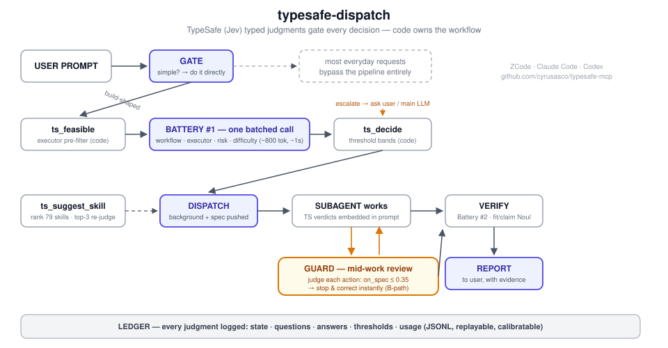

# typesafe-mcp

<p align="center"></p>

**What is this?** A ZCode / Claude Code / Codex plugin that gates multi-agent dispatch with TypeSafe System One (Jev) typed judgments instead of vibes: one batched ~1s call decides workflow, executor, risk and difficulty; a 79-skill catalog two-stage suggests which skill to load; a mid-work guard stops a subagent the moment an action goes off-spec (on_spec ≤ 0.35); every judgment lands in a replayable JSONL ledger. Simple requests bypass everything (GATE).


**TypeSafe System One dispatch pipeline as a multi-target agent plugin** — one
self-contained `plugin/` ships to **ZCode**, **Claude Code**, and **Codex
CLI**: typed subagent routing (Battery #1), deterministic thresholds,
destructive-op guard, usage ledger. Zero-dependency stdio MCP server (node 18+,
plain fetch, node:crypto) wrapping the [TypeSafe](https://typesafe.ai) System
One API (Jev), plus the executor registry and skill for the
`typesafe-dispatch` pipeline.

JSON-RPC 2.0 over stdio, one message per line. The plugin is fully
self-contained: server, launcher, skill, hook, and default data files all ship
inside `plugin/`.

## Install — ZCode

1. In ZCode: **Discover** → **`+`** → add this GitHub repo:
   `https://github.com/cyrusasco/typesafe-mcp`
2. Install the **typesafe-dispatch** plugin. ZCode wires the `ts_*` MCP tools
   (`ts_ping`, `ts_ask`, `ts_decide`, `ts_safety`, `ts_feasible`) and the
   `typesafe-dispatch` skill automatically (ZCode probes
   `plugin/.zcode-plugin/plugin.json`).
3. Bring your own TypeSafe API key — see [API key](#api-key) below.

Optional (ZCode has no plugin hook registration): register a `UserPromptSubmit`
hook pointing at `node <path-to>/hooks/dispatch-reminder.mjs` (repo root copy;
the script reads the prompt on stdin and prints JSON `additionalContext`, or
exits silently for simple requests).

## Install — Claude Code

```
claude plugin marketplace add cyrusasco/typesafe-mcp
claude plugin install typesafe-dispatch@typesafe-mcp
```

Claude Code probes `plugin/.claude-plugin/plugin.json` (manifest, validated
with `claude plugin validate`) and wires, with no extra steps:

- **MCP server** — `plugin/.mcp.json`: `node ${CLAUDE_PLUGIN_ROOT}/mcp-launcher.mjs`
- **Skill** — auto-discovered from `plugin/skills/typesafe-dispatch/`
- **Reminder hook** — `plugin/hooks/hooks.json` registers
  `hooks/dispatch-reminder.mjs` on `UserPromptSubmit` (build-shaped prompts get
  a one-line nudge toward the skill; simple prompts stay untouched)

Then bring your own TypeSafe API key — see [API key](#api-key) below.

## Install — Codex CLI

Codex has no plugin system, so two pieces:

1. **Skill** — via the [skills CLI](https://github.com/vercel-labs/skills)
   (verified: it discovers `typesafe-dispatch` in this repo):

   ```
   npx skills add cyrusasco/typesafe-mcp --skill typesafe-dispatch
   ```

   Select **Codex** as the target when prompted (installs into
   `~/.codex/skills/`; add `-g` for global). Without the CLI, copy
   `plugin/skills/typesafe-dispatch/` into `~/.codex/skills/typesafe-dispatch/`
   manually.

2. **MCP server** — add to `~/.codex/config.toml` (stdio; use the path of your
   clone of this repo, forward slashes on Windows):

   ```toml
   [mcp_servers.typesafe]
   command = "node"
   args = ["<repo>/plugin/server.mjs"]
   ```

   Set `TYPESAFE_API_KEY` in your environment (or drop a `.env` next to
   `plugin/server.mjs` — copy `plugin/.env.example`). Without a key the server
   still starts: `ts_ask` returns `{mode:"degraded", reason:"no_key"}` and
   never calls the API, while `ts_decide` / `ts_safety` / `ts_feasible` /
   `ts_ping` work fully offline. Codex has no hook mechanism — the
   UserPromptSubmit reminder does not apply; invoke the skill (or its GATE)
   yourself.

## API key

**Bring your own TypeSafe API key** — the server degrades gracefully without
one (`ts_ask` returns `{mode:"degraded", reason:"no_key"}` and never calls the
API). Set it either way:

- `TYPESAFE_API_KEY` as a real environment variable (recommended — survives
  plugin updates), or
- a `.env` file next to the installed `server.mjs` (copy
  `plugin/.env.example`). Optional: point `TYPESAFE_DATA_DIR` at a stable
  directory so your `.env` + ledger survive plugin-cache refreshes.

Key resolution order: `process.env` → `<data dir>/.env` → `<plugin dir>/.env`
→ `~/.claude/settings.json` env block. Values are never logged.

### Data layout (where your stuff lives)

The server resolves one **data dir** at startup, in this order:

1. `$TYPESAFE_DATA_DIR` if set;
2. the plugin's **parent directory**, when it contains `executors.json`
   (a repo checkout / marketplace-root layout — this is what you get when
   running from a clone, so the ledger stays at the repo root);
3. the **plugin directory itself** (self-contained install; the shipped
   default `executors.json` / `patterns.json` are used).

The data dir holds `ledger/` (append-only usage log — personal, gitignored),
`.env`, `executors.json`, `patterns.json`. Edit the `executors.json` copy in
your data dir to change the executor registry; `ts_feasible` reads it
automatically.

### UserPromptSubmit reminder hook (details)

`plugin/hooks/dispatch-reminder.mjs` detects build-shaped prompts and injects
a one-line reminder to consult the `typesafe-dispatch` skill:

- **Claude Code** — registered automatically via `plugin/hooks/hooks.json`.
- **ZCode** — register a `UserPromptSubmit` hook in your config pointing at
  `node <path-to>/hooks/dispatch-reminder.mjs` (use your own absolute path;
  a repo-root copy lives in `hooks/`).
- **Codex CLI** — no hook mechanism; not applicable.

## Tools

| Tool | What |
| --- | --- |
| `ts_ping` | Health: has_key / model / today's token usage vs cap / circuit breaker. No API call. |
| `ts_ask` | THE one generic batched ask. Pre-flight: `no_key` → `budget_capped` → `breaker_open` all return `{mode:"degraded",reason}` without calling the API; `depth>0` rejected (recursion guard — subagents must not call). Redacts secrets before egress (count only). 429/529 retried w/ backoff; 422 surfaces the validation body (caller bug). |
| `ts_decide` | Deterministic threshold enforcement (the skill supplies semantics only). choice/score confidence: ≥0.75 auto, 0.5–0.75 flagged, <0.5 escalate. noul: ≥0.8 yes, ≤0.2 no, 0.35–0.65 escalate (deadband), else flagged_yes/no. Policy arg overrides per-kind/per-question. |
| `ts_safety` | **P0 #1** — destructive-op detection is deterministic code (`patterns.json`), never TS. destructive + not user-confirmed → always ask the user. |
| `ts_feasible` | **P0 #2** — hard-availability pre-filter of the executor registry (`requires.env` set, `requires.command` on PATH) so TS Choice only ever chooses among feasible executors. |

## Env vars (see `plugin/.env.example`)

`TYPESAFE_API_KEY` (required for normal mode), `TYPESAFE_MODEL` (default
`jev-latest`), `TYPESAFE_DAILY_TOKEN_CAP` (200000), `TYPESAFE_TIMEOUT_MS`
(5000), `TYPESAFE_MAX_RETRIES` (2), `TYPESAFE_DATA_DIR` (optional data-dir
pin).

## Ledger

`<data dir>/ledger/YYYY-MM-DD.jsonl` — one atomic append per call
(`fs.appendFileSync`). Fields: ts, call_id, tool, battery, depth, lang, mode,
model, questions_hash (sha256 of canonical questions — template-drift
detection), state_bytes, redactions, answers_summary (top-line values only),
usage, latency_ms, decision?, error?. **Never raw secrets or full state.**

## Circuit breaker

≥3 consecutive transient failures (timeout / network / 5xx / exhausted 429)
→ open for 5 min → ts_ask degrades with `breaker_open`; a probe after cooldown
is allowed (half_open). 401/422 are caller/config errors: thrown as errors,
not counted.

## Local development

```
node scripts/smoke.mjs        # 23 checks, no key, no network, no cost — ALL GREEN = pass
node scripts/live-test.mjs    # one REAL API call (costs a few hundred tokens; needs a key)
node scripts/cli.mjs ping     # CLI surface: ping|ask|decide|safety|feasible
node scripts/cli.mjs safety "git push --force origin main"
```

When running from a clone, scripts/ and the live data (`ledger/`, `executors.json`,
`.env`) sit at the repo root; the server inside `plugin/` picks them up via
rule 2 of the data-dir resolution. `.env` and `ledger/` are gitignored — your
key and usage history never leave the machine.

Manifest validation (Claude Code target):

```
claude plugin validate .        # marketplace manifest
claude plugin validate plugin   # plugin manifest (strict-clean as of v1.2.0)
```

The `typesafe-dispatch` skill (in `plugin/skills/typesafe-dispatch/SKILL.md`)
documents the full pipeline: GATE philosophy, Battery #1 template, state
guidance, threshold table, recursion guard, degraded mode, and the pilot
success criteria that must be met before Batteries #2/#3 get built.

## License

MIT — see [LICENSE](LICENSE).

## Pilot log

- **2026-09-20 — full-pipeline E2E (all stages green):** Gate → ts_feasible → Battery #1 (6 questions, 1 call, 833 tok) → ts_decide (one deadband escalate resolved by main LLM per protocol) → guarded background dispatch → subagent (2 tool calls, correct output, ground-truth verified) → Battery #2 verify (format 0.91 / value 0.96 → auto). Total: **1,353 TS tokens, 2 ask calls**. Lessons folded into SKILL.md §2/§10 (MSYS /tmp path trap; deadband-on-immaterial-question resolution).
- **2026-09-20 — v1.4.0 skill-suggestion shipped (ts_suggest_skill):** two-request progressive disclosure over the 79-skill local catalog (junction/symlink-aware). Acceptance: Shopage CSS → shopage-modifier (fit 0.95) ✅; small refactor → honest null (review/ponytail fits ≈0.35 — heavyweight workflows, correct anti-over-load) ✅; translation → null (needs_skill 0.11) ✅; --require → 0 API calls ✅. Fit-led rule after measurement: Choice confidence cannot gate generic-candidate rosters (docs: low confidence ≠ invalid preference); confidence now only surfaces near-ties. ~9.4k in / 0.9k out tokens per suggest.
- **2026-09-21 — v1.5.0:** A-path verdict finalized: ZCode confirmed NOT firing PreToolUse for subagent tool calls (2nd experiment: queued spec + off-scope Write sailed through) — mid-work guard on ZCode is the B-path monitor, now ONE command (`cli.mjs judge "<spec>" "<action>"` → proceed/inspect/correct + ready-made directive; measured off-spec 0.01 → correct). Injection reminder now carries the guard protocol. Skill-suggestion confirmed working in real use (audit of 105 ledger lines). README got a pipeline diagram (docs/pipeline.svg).
